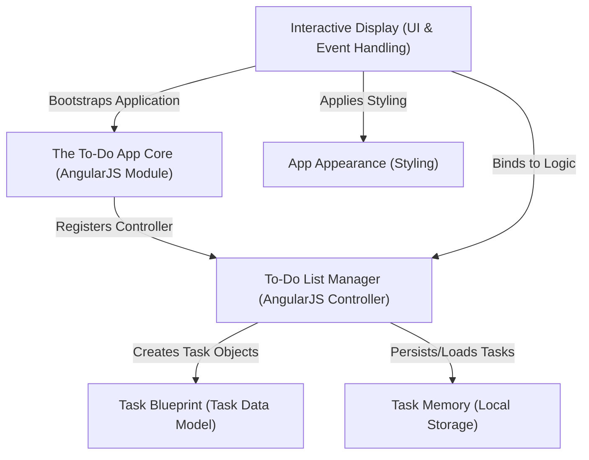
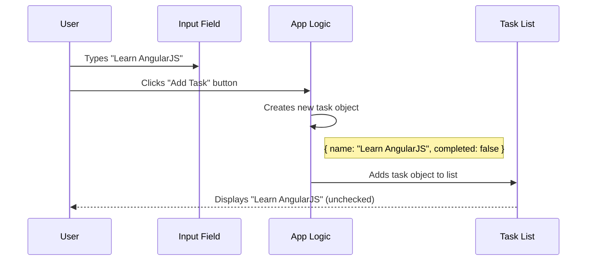
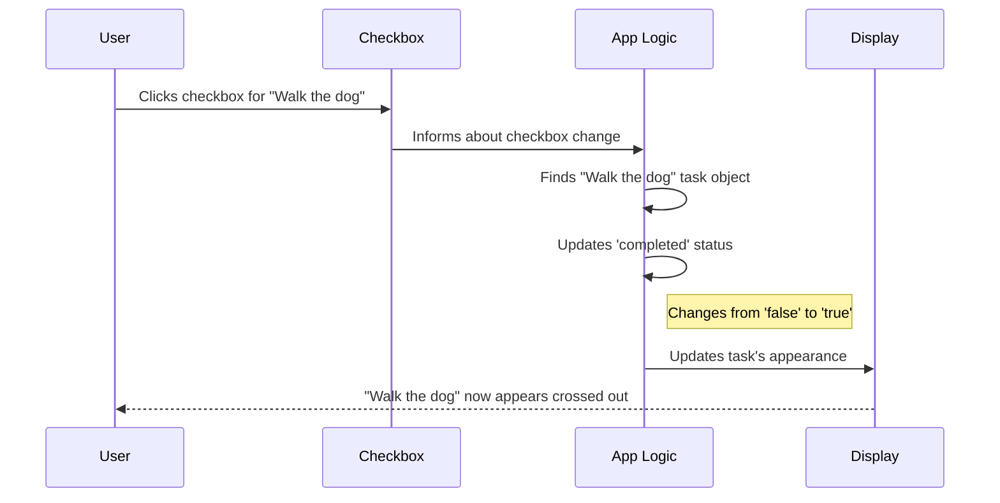
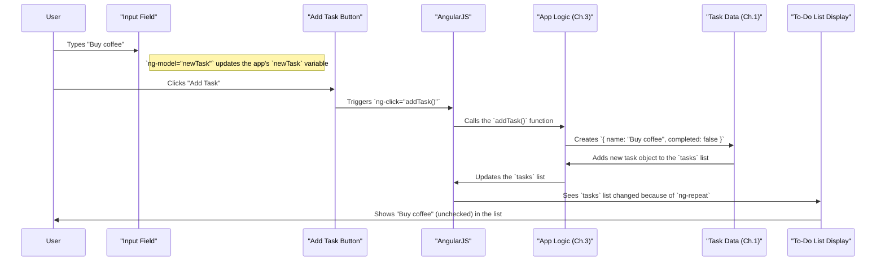
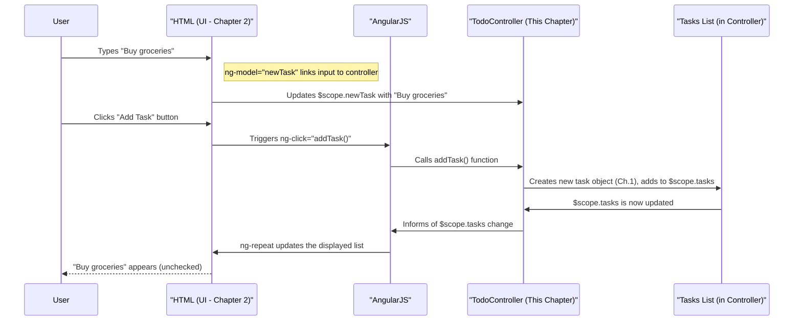
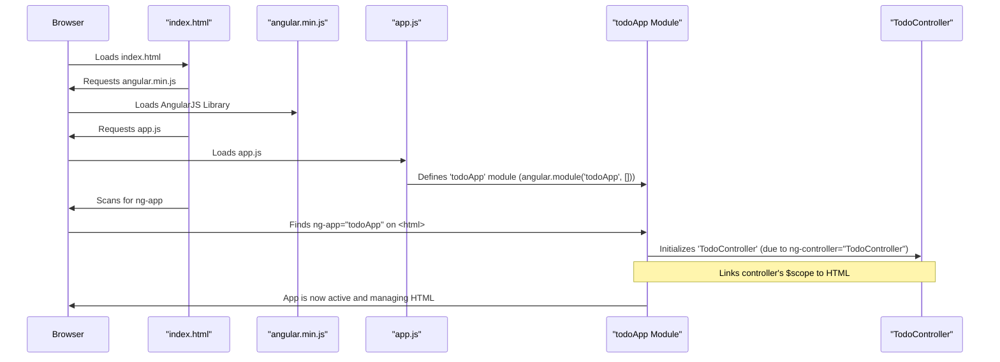
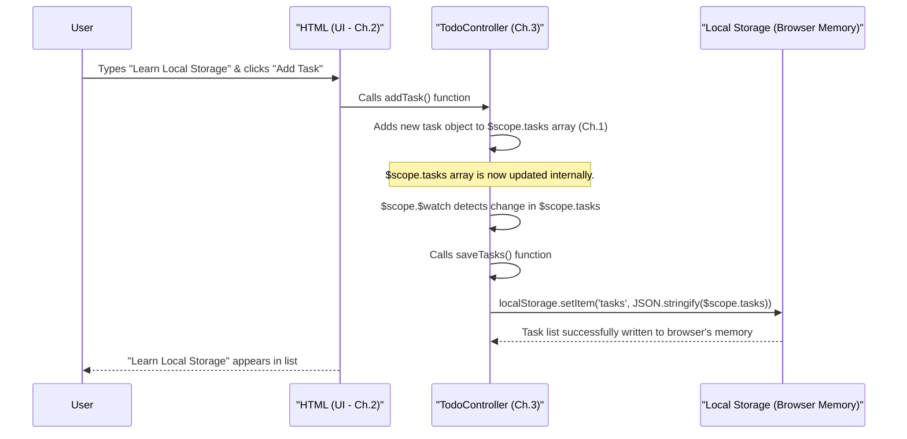
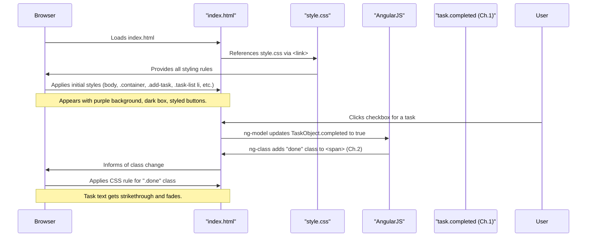

# Tutorial: To-Do-App2.0

This project is a simple yet effective *To-Do List application* designed to help you **organize your daily tasks**. You can easily **add new items**, mark them as *completed*, or **remove them** when no longer needed. The app even remembers your tasks across browser sessions, so you never lose your progress!


## Visual Overview



## Chapters

1. [Task Blueprint (Task Data Model)
](01_task_blueprint__task_data_model__.md)
2. [Interactive Display (UI & Event Handling)
](02_interactive_display__ui___event_handling__.md)
3. [To-Do List Manager (AngularJS Controller)
](03_to_do_list_manager__angularjs_controller__.md)
4. [The To-Do App Core (AngularJS Module)
](04_the_to_do_app_core__angularjs_module__.md)
5. [Task Memory (Local Storage)
](05_task_memory__local_storage__.md)
6. [App Appearance (Styling)
](06_app_appearance__styling__.md)

---

<sub><sup>Generated by [AI Codebase Knowledge Builder](https://github.com/The-Pocket/Tutorial-Codebase-Knowledge).</sup></sub>

# Chapter 1: Task Blueprint (Task Data Model)

Welcome to the exciting world of building a To-Do app! In this first chapter, we're going to dive into the very foundation of our application: understanding what a single "To-Do" item truly is.

### What is a To-Do, Really?

Imagine you write "Buy groceries" on a piece of paper. That's a To-Do item. Simple, right? But what if you want to mark it as "done"? Or what if you want to store extra information about it, like when you added it? Just the text "Buy groceries" isn't enough anymore.

This is where our "Task Blueprint" comes in!

### The Problem: Just Text Isn't Enough

If our app only thinks of a To-Do as plain text, it would be hard to do smart things like:
*   **Marking as completed**: How do we know if "Buy groceries" is done or not, just by looking at the text?
*   **Showing it differently**: How do we make completed tasks look crossed out?
*   **Keeping track**: How do we manage many tasks consistently?

We need a standardized way to represent each To-Do item inside our app.

### The Solution: A Task Blueprint (Task Data Model)

Think of the "Task Blueprint" like a **recipe card** for every To-Do item. Every time you create a new To-Do, our app fills out a new recipe card following the same pattern. This ensures that all To-Do items are organized in the same way, making it easy for the app to understand and manage them.

In our To-Do app, this blueprint says that every task will have two main pieces of information:

1.  **`name`**: This is the actual text of your To-Do, like "Walk the dog" or "Pay bills." It's what you type.
2.  **`completed`**: This is a simple `true` or `false` status.
    *   `false` means the task is **not yet done**.
    *   `true` means the task **is completed**.

So, instead of just storing "Walk the dog", our app stores something more like this:

```
{
  name: "Walk the dog",
  completed: false
}
```

This is called a **task object** or a **data model**. It's a small, organized packet of information for each of your To-Dos.

### How Our App Uses the Task Blueprint

Let's see how this blueprint is used when you interact with the app.

#### Use Case: Adding a New Task

When you type a new task, like "Learn AngularJS", and click "Add Task", here's what happens:



The app takes your text and immediately creates a new task object, setting its `name` to what you typed and `completed` to `false` by default (because it's a new task, it's not done yet!).

You can see this happening in our `app.js` file when a task is added:

```javascript
// From app.js, inside the addTask function:
$scope.tasks.push({ name: $scope.newTask.trim(), completed: false });
// This line creates a new task object!
```

**Explanation**:
*   `$scope.tasks.push(...)` means "add a new item to our list of tasks."
*   `{ name: $scope.newTask.trim(), completed: false }` is our task blueprint in action! It creates a new object.
    *   `name:` takes the text from the input box (`$scope.newTask`).
    *   `completed: false` automatically sets the task as not done.

#### Use Case: Marking a Task as Completed

When you click the checkbox next to a task, say "Walk the dog", here's what happens:



The app doesn't just "remember" that it's checked; it updates the `completed` status inside that specific task's object from `false` to `true`.

You can see how the app connects the checkbox to our `completed` status in `index.html`:

```html
<!-- From index.html, inside the list item for each task -->
<li ng-repeat="task in tasks">
  <input type="checkbox" ng-model="task.completed">
  <span ng-class="{done: task.completed}">{{task.name}}</span>
  <!-- ... other buttons ... -->
</li>
```

**Explanation**:
*   `ng-repeat="task in tasks"`: This part tells AngularJS to go through our list of `tasks`. For each task, it temporarily calls it `task`.
*   `{{task.name}}`: This displays the `name` property from our `task` object (e.g., "Walk the dog").
*   `ng-model="task.completed"`: This is a super important line! It connects the state of the checkbox directly to the `completed` property of our `task` object.
    *   If you check the box, `task.completed` becomes `true`.
    *   If you uncheck the box, `task.completed` becomes `false`.
*   `ng-class="{done: task.completed}"`: This line uses the `completed` status. If `task.completed` is `true`, it adds a special style class called `done` to the `<span>` (which makes the text appear crossed out). If `task.completed` is `false`, the `done` class is removed.

### Why is this important?

Having a "Task Blueprint" (or data model) is crucial because it brings **consistency** and **predictability** to our application. Every To-Do item, no matter its text, is handled in the exact same structured way. This makes it much easier to write code that adds tasks, removes tasks, marks them as done, or even saves them for later.

### Conclusion

In this chapter, we learned that a To-Do item in our app is more than just text. It's a structured "task object" with a `name` (the text) and a `completed` status (true/false). This "Task Blueprint" helps our app store, display, and manage all your To-Do items in a smart and consistent way.

Now that we understand what a task *is*, let's move on to how we make these tasks appear on the screen and how the app reacts when you interact with them.

[Next Chapter: Interactive Display (UI & Event Handling)](02_interactive_display__ui___event_handling__.md)

---

<sub><sup>Generated by [AI Codebase Knowledge Builder](https://github.com/The-Pocket/Tutorial-Codebase-Knowledge).</sup></sub> <sub><sup>**References**: [[1]](https://github.com/anantha-ctrl/To-Do-App2.0/blob/2f13a495bb0e1366e3f41bb30440629124f54feb/app.js), [[2]](https://github.com/anantha-ctrl/To-Do-App2.0/blob/2f13a495bb0e1366e3f41bb30440629124f54feb/index.html)</sup></sub>

# Chapter 2: Interactive Display (UI & Event Handling)

Welcome back, future app developer! In [Chapter 1: Task Blueprint (Task Data Model)](01_task_blueprint__task_data_model__.md), we learned that each to-do item in our app is not just text, but a structured "task object" with a `name` and a `completed` status. This blueprint helps our app understand and manage tasks internally.

But how do you *see* these tasks? How do you add new ones, check them off, or delete them? That's what this chapter is all about! We'll explore how our app creates the visual elements you interact with (the User Interface or UI) and how it responds when you click buttons or type (Event Handling).

### The Problem: Our Task Data Needs a Face and Ears!

Imagine you have all your task "recipe cards" (our task objects) neatly organized, but they're locked away in a drawer. You can't see them, and you can't add new ones or mark them done.

This is the problem our "Interactive Display" solves:

*   **Problem 1: How do users see the tasks?** Our task objects are just data. We need to turn that data into something visual on the screen.
*   **Problem 2: How do users *do* things with tasks?** How can they add a new task, mark one as complete, or delete it? The app needs to "hear" when a user does something and then "react."

### The Solution: UI (User Interface) & Event Handling

Think of our To-Do app like a simple control panel:

*   **UI (User Interface):** This is the dashboard itself. It includes the screen that *shows* you all your tasks, the input box where you *type* new tasks, and the buttons you *press*. It's everything you see and touch on the webpage.
*   **Event Handling:** These are the wires and mechanisms inside the dashboard that *detect* when you press a button or flip a switch. When you click "Add Task," that's an "event," and the app's "event handler" notices it and tells the app what to do next.

AngularJS helps us connect these two parts seamlessly. It's like having a smart assistant that constantly watches your UI and, when an event happens, automatically tells the right part of your app's logic to spring into action.

### Building Our UI: The HTML Structure (`index.html`)

Our app's visual elements are built using standard HTML, but with a special AngularJS twist. Let's look at the key parts from our `index.html` file.

#### 1. The Input Field and "Add Task" Button

This is where you'll type your new tasks.

```html
<!-- From index.html -->
<div class="add-task">
  <input type="text" ng-model="newTask" placeholder="Enter a new task..." ng-keypress="checkEnter($event)">
  <button ng-click="addTask()">Add Task</button>
</div>
```

**Explanation:**
*   `<input type="text" ...>`: This is a standard HTML input box.
*   `ng-model="newTask"`: This is an **AngularJS directive**! It creates a two-way connection. Whatever you type into this box is automatically stored in a variable called `newTask` inside our app's brain. And if `newTask` changes in the app's brain, the text in this box will also update!
*   `ng-keypress="checkEnter($event)"`: This is an **event handler**. It says: "If a key is pressed while typing in this box, run the `checkEnter()` function." This lets us add tasks by hitting the Enter key.
*   `<button ng-click="addTask()">Add Task</button>`: This is our "Add Task" button.
*   `ng-click="addTask()"`: Another **event handler**! It tells AngularJS: "When someone clicks this button, please run the `addTask()` function."

#### 2. The List of Tasks

This is where all your existing to-do items are displayed.

```html
<!-- From index.html -->
<ul class="task-list">
  <li ng-repeat="task in tasks">
    <input type="checkbox" ng-model="task.completed">
    <span ng-class="{done: task.completed}">{{task.name}}</span>
    <button class="delete" ng-click="removeTask($index)">❌</button>
  </li>
</ul>
```

**Explanation:**
*   `<ul class="task-list">`: An unordered list, standard HTML.
*   `<li ng-repeat="task in tasks">`: This is a powerful **AngularJS directive**! It tells AngularJS: "Go through every item in our `tasks` list (which holds our task objects from [Chapter 1: Task Blueprint (Task Data Model)](01_task_blueprint__task_data_model__.md)). For each item, create an `<li>` element and temporarily call that item `task`."
*   `<input type="checkbox" ng-model="task.completed">`: This checkbox's state (checked or unchecked) is directly linked to the `completed` property of the `task` object. If you check it, `task.completed` becomes `true`. If you uncheck it, it becomes `false`.
*   `<span ng-class="{done: task.completed}">{{task.name}}</span>`:
    *   `{{task.name}}`: This is **data binding**. It displays the `name` property of the current `task` object (e.g., "Walk the dog").
    *   `ng-class="{done: task.completed}"`: This is another **AngularJS directive**. It dynamically adds or removes a CSS class called `done`. If `task.completed` is `true`, the `done` class is added (making the text crossed out). If `task.completed` is `false`, the class is removed.
*   `<button class="delete" ng-click="removeTask($index)">❌</button>`: This is the delete button. When clicked, it calls the `removeTask()` function, passing `$index` to know which task to delete. `$index` is a special AngularJS variable that tells us the position of the current task in the list.

### How it All Connects: Adding a New Task Example

Let's trace what happens when you use the "Interactive Display" to add a new task:



As you can see, AngularJS acts like a super-smart middleman. It constantly watches the `ng-model` and `ng-repeat` directives. When your actions trigger `ng-click` or `ng-keypress`, it calls the right function in our app's logic. Then, when the app's data changes, AngularJS automatically updates the display, making your app *interactive*!

### Why is this important?

Separating the UI (HTML) from the application's brain (logic, which we'll cover in the next chapter) makes code much easier to understand and maintain.

*   **HTML (UI):** Focuses solely on *what* the user sees and *where* they can interact.
*   **AngularJS Directives (`ng-model`, `ng-click`, `ng-repeat`, `{{}}`):** Act as the magic glue, effortlessly connecting the visual parts of your app to its internal data and functions. You don't have to write complex code to manually find HTML elements and update them.
*   **App Logic (JavaScript):** Can focus purely on *how* to process information, without worrying about how to make things appear on screen.

### Conclusion

In this chapter, we've explored the "Interactive Display" of our To-Do app. We learned that the **UI (User Interface)** is the HTML you see and interact with, and **Event Handling** is how the app detects and responds to your actions (like clicks or typing). AngularJS, with its powerful directives like `ng-model`, `ng-click`, and `ng-repeat`, provides an elegant way to link these visual elements directly to our app's underlying data and logic, making the whole experience interactive.

Now that we understand how the display works and how it "listens" for your actions, let's dive into the "brain" of our application that *performs* those actions.

[Next Chapter: To-Do List Manager (AngularJS Controller)](03_to_do_list_manager__angularjs_controller__.md)

---

<sub><sup>Generated by [AI Codebase Knowledge Builder](https://github.com/The-Pocket/Tutorial-Codebase-Knowledge).</sup></sub> <sub><sup>**References**: [[1]](https://github.com/anantha-ctrl/To-Do-App2.0/blob/2f13a495bb0e1366e3f41bb30440629124f54feb/index.html)</sup></sub>

# Chapter 3: To-Do List Manager (AngularJS Controller)

Welcome back, future app developer! In [Chapter 2: Interactive Display (UI & Event Handling)](02_interactive_display__ui___event_handling__.md), we learned how the visual parts of our app (the UI) are built with HTML and how AngularJS directives like `ng-click` and `ng-model` help our app "listen" for your actions. We saw how clicking an "Add Task" button triggers a function.

But who actually *performs* that function? Who holds the entire list of tasks, knows which ones are completed, and calculates how many are left? That's what this chapter is all about! We're diving into the "brain" or "conductor" of our To-Do list: the **AngularJS Controller**.

### The Problem: Our Interactive Display Needs a Brain!

Imagine you're driving a car. You press the gas pedal (an "event"), and the car speeds up (an "action"). But the pedal itself doesn't make the car go; there's an engine, a transmission, and a driver making decisions behind the scenes.

Similarly, in our app:
*   The "Add Task" button is like the gas pedal. You click it.
*   The checkbox is like the brake pedal. You check it.

But who is the "driver" and "engine" that handles these actions?
*   Where does the app keep the list of all tasks?
*   How does it know which task to add, remove, or mark as complete?
*   How does it count the remaining tasks?

We need a central place to store our data (like our list of [Task Blueprint (Task Data Model)](01_task_blueprint__task_data_model__.md) objects) and all the instructions for what to *do* with that data when you interact with the app.

### The Solution: The AngularJS Controller

Think of the **AngularJS Controller** as the main brain or the "To-Do List Manager" for a part of your application. It's a special JavaScript function that has three main jobs:

1.  **Holds the Data**: It keeps track of all the information your app needs, like our entire list of tasks (`tasks`) and the text you're currently typing for a new task (`newTask`).
2.  **Performs Actions**: It contains all the instructions (functions) for what should happen when you click a button or check a box (e.g., `addTask()`, `removeTask()`, `clearCompleted()`).
3.  **Connects to the HTML**: It uses a special object called `$scope` to share its data and functions directly with the HTML, making the UI come alive.

Let's look at how this "brain" helps us manage our tasks, specifically focusing on the core task of **adding a new task**.

### Use Case: Adding a New Task (The Controller in Action)

When you type "Buy groceries" and click "Add Task", here's how our Controller works with the UI to make it happen:



As you can see, the Controller is at the heart of the action, managing the data and performing the logic whenever the HTML (through AngularJS) tells it something has happened.

### Dissecting the Controller's Brain (`app.js`)

Our To-Do List Manager (the `TodoController`) lives in the `app.js` file. Let's break down its key parts.

#### 1. Defining the Controller

First, we tell AngularJS that we want to create a Controller.

```javascript
// From app.js
var app = angular.module('todoApp', []); // This line creates our app module (Ch.4)

app.controller('TodoController', function($scope) {
  // All the magical logic for our To-Do List Manager goes here!
  // It's like the main office for managing tasks.
});
```

**Explanation:**
*   `app.controller('TodoController', function($scope) { ... });`: This is how we define our Controller.
    *   `'TodoController'` is the name we give to our manager. We'll use this name in our HTML to say, "Hey, this part of the HTML should be managed by `TodoController`!"
    *   `function($scope) { ... }`: This is the actual brain of our Controller. It's a standard JavaScript function, and inside it, we'll write all our logic.

#### 2. The Magic of `$scope`

Inside that `function($scope)`, you'll notice `$scope`. This is a super important part of AngularJS!

**What is `$scope`?**
Think of `$scope` as a **shared whiteboard** between your Controller (the brain) and your HTML (the display).
*   The Controller writes data (like the list of tasks) and functions (like `addTask`) onto this whiteboard.
*   The HTML reads this data and calls these functions from the whiteboard.
*   If the HTML updates something (like typing in an input box linked by `ng-model`), it also writes to `$scope`, and the Controller can read it.

It's the main way data flows back and forth between your JavaScript logic and your webpage's display.

Let's see `$scope` in action:

```javascript
// Inside TodoController in app.js
app.controller('TodoController', function($scope) {

  // 1. $scope.tasks: This holds our entire list of task objects (Ch.1)
  //    The HTML uses ng-repeat="task in tasks" to display these.
  $scope.tasks = JSON.parse(localStorage.getItem('tasks')) || []; // (Ch.5)

  // 2. $scope.newTask: This holds the text typed into the input box
  //    The HTML uses ng-model="newTask" to connect to this.
  $scope.newTask = '';

  // 3. $scope.addTask: This is a function the Controller provides
  //    The HTML uses ng-click="addTask()" to call this.
  $scope.addTask = function() {
    if ($scope.newTask && $scope.newTask.trim() !== "") {
      // Create a new task object (Ch.1) and add it to our list
      $scope.tasks.push({ name: $scope.newTask.trim(), completed: false });
      $scope.newTask = ''; // Clear the input field after adding
      // $scope.saveTasks(); // (We'll cover saving in Chapter 5)
    }
  };

  // ... other functions and data like removeTask, remaining, etc. ...
});
```

**Explanation:**
*   Notice how everything the HTML needs access to (our `tasks` list, the `newTask` text, the `addTask` function) is attached to `$scope`. This makes them available to the HTML.

And in our `index.html` (from [Chapter 2](02_interactive_display__ui___event_handling__.md)), we tell AngularJS which HTML elements are managed by our `TodoController`:

```html
<!-- From index.html -->
<body ng-controller="TodoController">
  <!-- All the content inside this <body> tag is now managed by TodoController. -->

  <div class="add-task">
    <input type="text" ng-model="newTask" placeholder="Enter a new task...">
    <button ng-click="addTask()">Add Task</button>
  </div>

  <ul class="task-list">
    <li ng-repeat="task in tasks">
      <!-- ... details for displaying each task ... -->
    </li>
  </ul>

  <div class="footer">
    <p>{{remaining()}} of {{tasks.length}} tasks remaining</p>
    <button ng-click="clearCompleted()">Clear Completed</button>
  </div>
</body>
```

**Explanation:**
*   `ng-controller="TodoController"`: This line on the `<body>` tag is crucial! It tells AngularJS, "Everything inside this `<body>` should use the `TodoController` as its manager. So, if I say `newTask` or `addTask()`, look for it on the `TodoController`'s `$scope`."

#### 3. Core Functions of Our To-Do List Manager

Our `TodoController` handles all the main logic for managing tasks. Here are some of the key functions it contains:

| Controller Function           | What it Does

---

<sub><sup>Generated by [AI Codebase Knowledge Builder](https://github.com/The-Pocket/Tutorial-Codebase-Knowledge).</sup></sub> <sub><sup>**References**: [[1]](https://github.com/anantha-ctrl/To-Do-App2.0/blob/2f13a495bb0e1366e3f41bb30440629124f54feb/app.js), [[2]](https://github.com/anantha-ctrl/To-Do-App2.0/blob/2f13a495bb0e1366e3f41bb30440629124f54feb/index.html)</sup></sub>

# Chapter 4: The To-Do App Core (AngularJS Module)

Welcome back, future app developer! In [Chapter 3: To-Do List Manager (AngularJS Controller)](03_to_do_list_manager__angularjs_controller__.md), we learned that our `TodoController` is like the "brain" or "manager" that holds our tasks and knows how to add, remove, and update them. It’s the smart logic that responds to your clicks and types.

But how does your browser know that your `index.html` file *is* an AngularJS application? How does it know that there's a `TodoController` that should manage parts of that HTML? We need something to say, "Hey, browser! This whole section here is an AngularJS app, and here's where all its pieces (like our Controller) are registered."

### The Problem: Our App Needs a "Headquarters"

Imagine you've built a fantastic team (your `TodoController`), but there's no official company to house them. No one knows where the team works, what projects they're assigned to, or even that the company exists!

Similarly, in our app:
*   Your `index.html` is just a webpage.
*   Your `app.js` contains your `TodoController` code.

The browser will load `index.html` and then `app.js`, but it won't automatically connect them or know that `TodoController` is meant to be used with the HTML. We need a central "headquarters" to bring everything together and tell AngularJS to take control.

### The Solution: The AngularJS Module (The App's Core)

Think of the **AngularJS Module** as the **main container** or the **"Company Headquarters"** for your entire To-Do app. It's the blueprint that declares:
1.  "This is an AngularJS application, and its name is `todoApp`."
2.  "Here are all the components (like our `TodoController`) that belong to this app."
3.  "This specific part of my HTML (`index.html`) should be managed by this `todoApp`."

Without this core module, AngularJS wouldn't know where to start, what parts of your HTML to control, or how to find your controllers and other logic. It's the essential starting point for any AngularJS application.

### Two Key Pieces of Our App Core

To create this "App Core," we need two main things:

1.  **Defining the Module:** We create the headquarters in our JavaScript (`app.js`).
2.  **Activating the Module:** We tell the HTML (`index.html`) where the headquarters is located.

Let's look at each.

#### 1. Defining the Module: Creating the Headquarters (`app.js`)

In `app.js`, we use `angular.module()` to officially create and name our application's core module.

```javascript
// From app.js
var app = angular.module('todoApp', []);

app.controller('TodoController', function($scope) {
  // ... our To-Do List Manager logic from Chapter 3 ...
});
```

**Explanation:**
*   `angular.module('todoApp', [])`: This is the crucial line that defines our app's core module.
    *   `'todoApp'`: This is the **name** of our application. It's like naming our "Company Headquarters." We'll use this name in our HTML to link everything up.
    *   `[]`: This is a list of "dependencies." For our simple app, we don't need any other special AngularJS features, so we leave it empty. Think of it as saying, "This headquarters doesn't need any special external departments to function."
*   `var app = ...`: We store this module in a variable called `app`. This allows us to easily add controllers, services, etc., to *this specific* module later (like `app.controller(...)`).

#### 2. Activating the Module: Hanging the "Company Sign" (`index.html`)

Once we've defined our module in `app.js`, we need to tell our HTML where this app should take effect. We do this using a special AngularJS instruction called a **directive**: `ng-app`.

```html
<!-- From index.html -->
<!DOCTYPE html>
<html lang="en" ng-app="todoApp">
<head>
  <meta charset="UTF-8">
  <title>To-Do List</title>
  <script src="https://ajax.googleapis.com/ajax/libs/angularjs/1.8.2/angular.min.js"></script>
  <script src="app.js"></script>
</head>
<body>
  <!-- ... our app content, including ng-controller="TodoController" ... -->
</body>
</html>
```

**Explanation:**
*   `ng-app="todoApp"`: This is an **AngularJS directive** placed on the `<html>` tag.
    *   It tells the browser: "The AngularJS application named `todoApp` should manage everything inside this `<html>` tag."
    *   It's like hanging the "To-Do App Headquarters" sign on the main building. Any AngularJS directives or components (`ng-model`, `ng-click`, `TodoController`, etc.) inside this area will now be recognized and managed by our `todoApp` module.

### How Our App Starts Up (The Core in Action)

Let's trace the journey of how our browser brings our To-Do app to life, involving our app's core module.



This sequence shows that the `todoApp` module acts as the central orchestrator. It gets defined first, then AngularJS finds where it's activated (`ng-app`), and then it starts managing everything within that `ng-app` area, including initializing our [To-Do List Manager (AngularJS Controller)](03_to_do_list_manager__angularjs_controller__.md).

### Why is this important?

The AngularJS Module is fundamental for several reasons:

| Aspect                 | Explanation                                                                                                 |
| :--------------------- | :---------------------------------------------------------------------------------------------------------- |
| **Bootstrapping**      | It's the starting point! It tells AngularJS to "wake up" and begin managing your application.              |
| **Organization**       | It's a central place to register all your app's components (controllers, services, filters, etc.).        |
| **Dependency Injection** | It defines what parts your app depends on, making it easier to manage and test different features.          |
| **Scope Management**   | It clearly defines which part of your HTML is controlled by AngularJS, preventing conflicts with other code. |

It sets the stage for your entire interactive To-Do app to run smoothly!

### Conclusion

In this chapter, we uncovered the "App Core" of our To-Do list – the **AngularJS Module**. We learned that `angular.module('todoApp', [])` defines our application's central "headquarters" in JavaScript, and the `ng-app="todoApp"` directive in our HTML tells AngularJS where this headquarters should take charge. This essential setup allows AngularJS to recognize and manage our controllers and interactive elements, making our To-Do app functional.

Now that our app has a working brain and a core, let's explore how we can make it "remember" your tasks even after you close and reopen the browser.

[Next Chapter: Task Memory (Local Storage)](05_task_memory__local_storage__.md)

---

<sub><sup>Generated by [AI Codebase Knowledge Builder](https://github.com/The-Pocket/Tutorial-Codebase-Knowledge).</sup></sub> <sub><sup>**References**: [[1]](https://github.com/anantha-ctrl/To-Do-App2.0/blob/2f13a495bb0e1366e3f41bb30440629124f54feb/app.js), [[2]](https://github.com/anantha-ctrl/To-Do-App2.0/blob/2f13a495bb0e1366e3f41bb30440629124f54feb/index.html)</sup></sub>

# Chapter 5: Task Memory (Local Storage)

Welcome back, future app developer! In [Chapter 4: The To-Do App Core (AngularJS Module)](04_the_to_do_app_core__angularjs_module__.md), we learned how our entire To-Do application is brought together under a central "headquarters" called the AngularJS Module. This core setup allows our [To-Do List Manager (AngularJS Controller)](03_to_do_list_manager__angularjs_controller__.md) to manage tasks, which are represented by our [Task Blueprint (Task Data Model)](01_task_blueprint__task_data_model__.md).

Now, imagine you've spent an hour adding all your important tasks, marking some as done, and perfectly organizing your list. You close your browser, grab a coffee, and when you come back, you open the app again... and all your tasks are gone! Poof! They vanished. Frustrating, right?

### The Problem: Our App Forgets Everything!

So far, our To-Do app is like a short-term memory expert. It remembers everything you do *while the app is open*. But as soon as you close the browser tab, refresh the page, or shut down your computer, all that valuable information (your list of tasks) is lost forever.

Why does this happen? Because all the data (`$scope.tasks`) our [TodoController](03_to_do_list_manager__angularjs_controller__.md) manages lives only in the computer's **RAM** (Random Access Memory) while the program is running. When the program stops or the browser tab closes, that temporary memory is cleared.

We need a way for our app to have a **long-term memory**.

### The Solution: Local Storage (The Browser's Long-Term Memory)

This is where **Local Storage** comes in! Think of Local Storage as a special, small notebook that your web browser keeps just for your app.
*   When your app needs to remember something important (like your list of tasks), it "writes" it down in this notebook.
*   Even if you close the browser or turn off your computer, the notebook stays safe.
*   The next time you open your app, it "reads" from this notebook, and voila! All your tasks are exactly as you left them.

Local Storage is perfect for our To-Do app because it allows the app to remember all your tasks across different sessions, preventing you from losing your progress and ensuring continuity.

### How Local Storage Works (The Basics)

Local Storage is quite simple to use. It's like a tiny filing cabinet in your browser that stores information in `key-value` pairs. Both the `key` (the name you use to find the information) and the `value` (the information itself) must be **strings** (plain text).

Here are the two main ways we interact with it:

1.  **Saving Information (`localStorage.setItem(key, value)`):**
    *   You tell Local Storage: "Here's a piece of information, and I'm giving it this specific name (key)."
    *   **Example:** `localStorage.setItem('username', 'Alice');`
    *   This is like writing "Alice" on a sticky note and labeling it "username" before sticking it to your browser's memory wall.

2.  **Getting Information (`localStorage.getItem(key)`):**
    *   You ask Local Storage: "Do you have any information saved under this specific name (key)?"
    *   **Example:** `let user = localStorage.getItem('username'); // user will be "Alice"`
    *   This is like looking for the sticky note labeled "username" and reading what's on it.

### The Challenge: Storing Our Task Objects

Remember our [Task Blueprint (Task Data Model)](01_task_blueprint__task_data_model__.md)? Our tasks are not just simple text; they are **objects** (like `{ name: "Walk dog", completed: false }`) and we store them in an **array** (`$scope.tasks`).

The problem is: **Local Storage can only store strings.** It can't directly store JavaScript objects or arrays.

### The Solution: JSON - Packaging Our Data

To solve this, we use something called **JSON** (JavaScript Object Notation), along with two special JavaScript functions:

1.  **`JSON.stringify(objectOrArray)`: Pack it up!**
    *   This function takes a JavaScript object or array and converts it into a single, special **string** that looks like an object/array.
    *   **Analogy:** Imagine you have a collection of items (your task objects in an array). `JSON.stringify()` is like carefully packing all those items into a box and then writing a detailed list of what's inside *on the outside of the box* as a single piece of text. You can then put this text (the box's label) into Local Storage.

2.  **`JSON.parse(jsonString)`: Unpack it!**
    *   This function takes a string (that was created by `JSON.stringify()`) and converts it back into a usable JavaScript object or array.
    *   **Analogy:** `JSON.parse()` is like reading that detailed list on the outside of the box and then perfectly recreating all the original items (task objects) inside your JavaScript app.

So, when we want to save our tasks, we'll `JSON.stringify()` them first. When we want to load them, we'll `JSON.parse()` them.

### Remembering Our Tasks: The Controller's Role (`app.js`)

Our [TodoController](03_to_do_list_manager__angularjs_controller__.md) is the perfect place to handle saving and loading tasks because it's already managing our `$scope.tasks` array.

#### 1. Loading Tasks When the App Starts

When our `TodoController` first starts up, it needs to check Local Storage for any previously saved tasks.

```javascript
// From app.js, inside TodoController
app.controller('TodoController', function($scope) {

  // Load saved tasks from localStorage when the app starts
  // It tries to get 'tasks' string, parses it, or starts with an empty array.
  $scope.tasks = JSON.parse(localStorage.getItem('tasks')) || [];

  // ... other controller code ...
});
```

**Explanation:**
*   `localStorage.getItem('tasks')`: This tries to retrieve the string stored under the key `'tasks'`.
    *   If tasks were saved before, it gets that JSON string.
    *   If no tasks were ever saved (e.g., first time running the app), it returns `null`.
*   `JSON.parse(...)`: This takes the retrieved string (or `null`) and tries to convert it back into a JavaScript array of task objects.
    *   If it gets a valid JSON string, it becomes our array.
    *   If it gets `null` (or invalid JSON), `JSON.parse(null)` returns `null`.
*   `|| []`: This is a JavaScript trick! It says: "If `JSON.parse(...)` resulted in something 'falsy' (like `null`), then use an empty array `[]` instead." This ensures our `$scope.tasks` is always an array, even if there's nothing saved yet.

This line ensures that whenever your app loads, it tries to read its "notebook" first to restore your task list!

#### 2. Saving Tasks Whenever They Change

We need to save our tasks every time the `$scope.tasks` array is modified (e.g., adding a new task, removing one, marking one as complete). We'll create a special function called `saveTasks` for this:

```javascript
// From app.js, inside TodoController
app.controller('TodoController', function($scope) {
  // ... tasks loading and other functions ...

  // Save tasks to localStorage
  $scope.saveTasks = function() {
    // Convert our tasks array into a JSON string
    const tasksJson = JSON.stringify($scope.tasks);
    // Save that string in Local Storage under the key 'tasks'
    localStorage.setItem('tasks', tasksJson);
  };

  // ... other controller code ...
});
```

**Explanation:**
*   `JSON.stringify($scope.tasks)`: Takes our current list of tasks (the array of objects) and converts it into one big JSON string.
*   `localStorage.setItem('tasks', tasksJson)`: Stores this JSON string in the browser's Local Storage with the name `'tasks'`.

Now, we just need to make sure this `saveTasks()` function is called whenever `tasks` changes. We could manually add `_scope.saveTasks();` to our `addTask()`, `removeTask()`, and `clearCompleted()` functions.

But AngularJS offers an even smarter way: **`$scope.$watch`**.

#### 3. Automatically Saving with `$scope.$watch`

`$scope.$watch` is like a diligent assistant. You tell it, "Hey, keep an eye on this specific variable (our `$scope.tasks` array). If you ever see it change, let me know, and I'll run this special function."

```javascript
// From app.js, inside TodoController
app.controller('TodoController', function($scope) {
  // ... tasks loading and all other functions ...

  // Watch for changes in the 'tasks' array and auto-save
  $scope.$watch('tasks', function(newVal, oldVal) {
    // Only save if the tasks array has actually changed
    // (newVal and oldVal refer to the tasks array before and after change)
    if (newVal !== oldVal) {
      $scope.saveTasks();
    }
  }, true); // The 'true' here is very important! It tells AngularJS to "deep watch"
            // the *contents* of the array, not just if the array itself is replaced.
});
```

**Explanation:**
*   `$scope.$watch('tasks', function(newVal, oldVal) { ... }, true);`
    *   `'tasks'`: This is the name of the `$scope` variable we want to watch.
    *   `function(newVal, oldVal) { ... }`: This is the function that runs *every time* `tasks` changes. `newVal` is the tasks after the change, `oldVal` is the tasks before.
    *   `if (newVal !== oldVal)`: This simple check prevents saving if AngularJS detects a change that isn't really a change (e.g., internal AngularJS optimizations).
    *   `true`: This last `true` is crucial for arrays and objects! It tells AngularJS to "deep watch" the array. This means it doesn't just check if the `tasks` array itself is replaced with a new array, but it also checks if any of the *items inside* the array have changed (like a task's `completed` status changing). Without `true`, changing a checkbox wouldn't trigger the save!

With `$scope.$watch`, our app now automatically saves your entire task list to Local Storage every time you add, remove, or modify a task.

### How Saving a Task Works with Local Storage

Let's see the full journey when you add a new task, and how Local Storage comes into play:



### Why is Task Memory Important?

Having "Task Memory" via Local Storage is fundamental for a real-world To-Do application:

| Aspect                     | Explanation                                                                                                 |
| :------------------------- | :---------------------------------------------------------------------------------------------------------- |
| **Persistence**            | Tasks remain even after browser closure or refresh, fulfilling the core expectation of a To-Do app.         |
| **User Experience (UX)**   | Users don't lose their work, leading to a much more reliable and pleasant experience.                       |
| **Continuity**             | Allows users to pick up exactly where they left off, regardless of when or how they last used the app.      |
| **Offline Capability (Basic)** | Since data is stored locally, the app can potentially display and manage tasks even without an internet connection (though saving new ones would depend on the backend for complex apps). |

### Conclusion

In this chapter, we tackled the crucial concept of "Task Memory" using **Local Storage**. We learned that Local Storage acts as your browser's persistent notebook, allowing our app to remember tasks across sessions. We explored how `JSON.stringify()` helps us package our [Task Blueprint (Task Data Model)](01_task_blueprint__task_data_model__.md) objects into strings for saving, and `JSON.parse()` unpacks them for loading. Finally, we saw how the `TodoController` uses `localStorage.getItem` at startup and the powerful `$scope.$watch` to automatically `localStorage.setItem` tasks whenever they change, ensuring your To-Do list is always up-to-date and never forgotten.

Now that our To-Do app can remember everything, let's make it look good!

[Next Chapter: App Appearance (Styling)](06_app_appearance__styling__.md)

---

<sub><sup>Generated by [AI Codebase Knowledge Builder](https://github.com/The-Pocket/Tutorial-Codebase-Knowledge).</sup></sub> <sub><sup>**References**: [[1]](https://github.com/anantha-ctrl/To-Do-App2.0/blob/2f13a495bb0e1366e3f41bb30440629124f54feb/app.js)</sup></sub>

# Chapter 6: App Appearance (Styling)

Welcome back, future app developer! In [Chapter 5: Task Memory (Local Storage)](05_task_memory__local_storage__.md), we finally taught our To-Do app to remember your tasks, even after you close the browser. Our app is now fully functional, can manage tasks, and won't forget them!

But let's be honest: while our app works great, it probably looks a bit... plain. Like a powerful car that's still just a metal frame – it drives, but it's not exactly eye-catching!

### The Problem: Our App Looks Like Plain Text!

Imagine opening your To-Do app right now. You'd see plain black text, white backgrounds, and basic buttons. All the functionality we built is there, but it's not very inviting or pleasant to use.

*   **Problem 1: It's boring to look at.** A plain app doesn't make you want to use it.
*   **Problem 2: It's not clear what's what.** Without colors or proper spacing, everything can blend together. How do you quickly tell a completed task from an active one?
*   **Problem 3: It doesn't feel modern.** Users expect apps to be visually appealing and easy on the eyes.

We need a way to make our app visually attractive and user-friendly, without changing *how* it works internally.

### The Solution: CSS (Cascading Style Sheets) - The App's Designer!

This is where **CSS** (Cascading Style Sheets) comes into play! Think of CSS as the app's **interior designer, painter, and decorator**. It's a special language that tells the browser *how* to display the HTML elements (the "furniture" of our app).

CSS dictates:
*   **Colors**: What background color the app has, text colors, button colors.
*   **Fonts**: The style and size of the text.
*   **Spacing**: How much room is between elements, like between tasks.
*   **Layout**: How elements are arranged on the screen.
*   **Special Effects**: Like rounded corners, shadows, or making text crossed out.

It's entirely separate from our app's logic (`app.js`) or data structure (`tasks` objects). This means we can completely change the look of our app without touching a single line of JavaScript!

### How Our App Uses CSS: `style.css`

Our To-Do app uses a file called `style.css` to hold all its design instructions.

First, we need to tell our `index.html` file to use this style sheet. This is done with a special `<link>` tag in the `<head>` section of `index.html`:

```html
<!-- From index.html -->
<head>
  <meta charset="UTF-8">
  <title>To-Do List</title>
  <!-- This line tells the browser to use our style.css file! -->
  <link rel="stylesheet" href="style.css">
  <script src="https://ajax.googleapis.com/ajax/libs/angularjs/1.8.2/angular.min.js"></script>
  <script src="app.js"></script>
</head>
```

**Explanation:**
*   `<link rel="stylesheet" href="style.css">`: This is like a note to the browser saying, "Hey, there's a file called `style.css` that contains all the styling rules for this page. Please load it and apply them!"

Now, let's explore some key parts of our `style.css` file and see what visual magic they perform.

#### 1. Styling the Whole Page (`body`)

The `body` element is the entire visible area of our webpage. This is where we set the overall background, font, and how the content is positioned.

```css
/* From style.css */
body {
  font-family: "Poppins", sans-serif; /* Use a nice modern font */
  background: linear-gradient(to right, #667eea, #764ba2); /* Purple gradient background! */
  color: #fff; /* White text color by default */
  display: flex;
  justify-content: center;
  align-items: center;
  height: 100vh;
}
```

**What it does visually:**
*   The entire background of your app changes from plain white to a beautiful **purple gradient** (fading from one purple to another).
*   All text by default will be **white** and use a stylish font called "Poppins."
*   The content of our app (the actual To-Do list box) will be perfectly **centered** in the middle of the screen.

#### 2. Styling the Main To-Do Container (`.container`)

Our entire To-Do list (input, tasks, footer) lives inside a `div` element with the class `container`. This is the main box you see.

```css
/* From style.css */
.container {
  background: #2c2c54; /* A dark, deep purple for the box background */
  border-radius: 12px; /* Smooth, rounded corners! */
  padding: 30px; /* Space inside the box */
  width: 360px; /* Fixed width for the box */
  box-shadow: 0 10px 20px rgba(0,0,0,0.2); /* A subtle shadow for depth */
}
```

**What it does visually:**
*   You now have a distinct, **dark purple box** in the center of your screen.
*   The corners of this box are **smoothly rounded**, not sharp.
*   There's some **space** between the edge of the box and its content.
*   A soft **shadow** makes the box appear to float slightly above the background, giving it a modern look.

#### 3. Styling the Input and "Add Task" Button (`.add-task`)

This section styles the area where you type new tasks.

```css
/* From style.css */
.add-task {
  display: flex; /* Makes input and button sit side-by-side */
  gap: 10px; /* Adds space between them */
  margin-bottom: 20px; /* Space below this section */
}

.add-task input {
  flex: 1; /* Input takes up available space */
  padding: 10px;
  border: none;
  border-radius: 6px;
  outline: none;
}

.add-task button {
  background: #6c5ce7; /* A brighter purple for the button */
  border: none;
  padding: 10px 15px;
  border-radius: 6px;
  cursor: pointer;
  color: white;
}
```

**What it does visually:**
*   The input box and "Add Task" button now sit neatly **next to each other** with a small gap.
*   The input field has **rounded corners** and a clean look.
*   The "Add Task" button is a distinct **purple** with **white text** and also has **rounded corners**, making it clear and clickable.

#### 4. Styling Individual Task Items (`.task-list li`)

This is where each To-Do item gets its unique look within the list.

```css
/* From style.css */
.task-list li {
  display: flex;
  align-items: center;
  justify-content: space-between;
  background: #40407a; /* A slightly lighter dark purple for each task */
  margin-bottom: 8px; /* Space between tasks */
  padding: 8px 10px;
  border-radius: 6px;
  transition: 0.3s; /* Smooth animation for hover effect */
}

.task-list li:hover {
  background: #706fd3; /* Even lighter purple when you hover! */
}
```

**What it does visually:**
*   Each task item now has its own **distinct dark purple background**, making it stand out as an individual item.
*   They are neatly arranged, with the checkbox, task text, and delete button **spaced out evenly**.
*   There's a subtle **gap between each task** item.
*   When you move your mouse over a task, its background **smoothly changes to a lighter purple**, providing visual feedback.

#### 5. Styling Completed Tasks (`.done`) - The Dynamic Look!

This is a cool part where styling connects with our app's logic from [Chapter 1: Task Blueprint (Task Data Model)](01_task_blueprint__task_data_model__.md) and [Chapter 2: Interactive Display (UI & Event Handling)](02_interactive_display__ui___event_handling__.md)!

Remember the `completed` property of our task objects? And how `ng-class="{done: task.completed}"` was used in `index.html`?

```html
<!-- From index.html, inside each task li -->
<span ng-class="{done: task.completed}">{{task.name}}</span>
```

When `task.completed` becomes `true` (you check the box), AngularJS *adds* the `done` class to the `<span>` element. When `task.completed` is `false`, it *removes* the `done` class. Our CSS file defines what that `done` class *looks like*:

```css
/* From style.css */
.done {
  text-decoration: line-through; /* Draw a line through the text! */
  opacity: 0.7; /* Make it slightly faded */
}
```

**What it does visually:**
*   When you check a task's box, the task text instantly gets a **strikethrough** (a line drawn through it) and becomes **slightly faded**. This clearly shows that the task is completed!
*   When you uncheck it, the `done` class is removed, and the text returns to normal. This is dynamic styling!

#### 6. Styling Other Elements (`.delete`, `.footer`)

The delete button and the footer also get their own styling:

```css
/* From style.css */
.delete {
  background: transparent;
  border: none;
  cursor: pointer;
  font-size: 16px;
}

.footer button {
  background: #ff4757; /* A red color for action buttons like "Clear Completed" */
  border: none;
  padding: 6px 12px;
  border-radius: 6px;
  color: white;
  cursor: pointer;
  margin: 3px;
}
```

**What it does visually:**
*   The "❌" delete button becomes more interactive.
*   The "Clear Completed" button in the footer turns **red** with **white text** and has **rounded corners**, making it stand out as an action button.

### How Styling Is Applied (Under the Hood)

Let's trace how your browser and our app work together to apply these styles:



This sequence shows that the browser first applies all the general styles from `style.css`. Then, as you interact with the app, AngularJS dynamically adds or removes CSS classes (like `done`), and the browser instantly updates the appearance based on those new classes!

### Why is App Appearance (Styling) Important?

Styling is far more than just making things look pretty. It's crucial for the success of any application:

| Aspect                     | Explanation                                                                                                 |
| :------------------------- | :---------------------------------------------------------------------------------------------------------- |
| **User Experience (UX)**   | A well-designed app is intuitive, pleasant to use, and reduces user frustration.                            |
| **Clarity & Readability**  | Proper fonts, spacing, and colors make content easier to read and understand.                               |
| **Brand Identity**         | Consistent styling helps establish a unique look and feel, making the app recognizable.                     |
| **Functionality Feedback** | Visual cues (like a strikethrough for completed tasks, or a button changing color on hover) provide immediate feedback to the user. |
| **Separation of Concerns** | Keeping styling (CSS) separate from structure (HTML) and logic (JavaScript) makes code easier to manage, update, and debug. |

### Conclusion

In this chapter, we learned all about "App Appearance (Styling)" using **CSS**. We saw how the `style.css` file acts as our app's designer, defining everything from background gradients and fonts to rounded corners and button colors. Most importantly, we understood how CSS works hand-in-hand with AngularJS directives like `ng-class` to create dynamic styles, making our app visually informative (like showing completed tasks with a strikethrough).

Our To-Do app now not only remembers your tasks but also looks great while doing it! This marks the completion of our beginner-friendly journey into building `To-Do-App2.0`. Congratulations!

---

<sub><sup>Generated by [AI Codebase Knowledge Builder](https://github.com/The-Pocket/Tutorial-Codebase-Knowledge).</sup></sub> <sub><sup>**References**: [[1]](https://github.com/anantha-ctrl/To-Do-App2.0/blob/2f13a495bb0e1366e3f41bb30440629124f54feb/style.css)</sup></sub>


